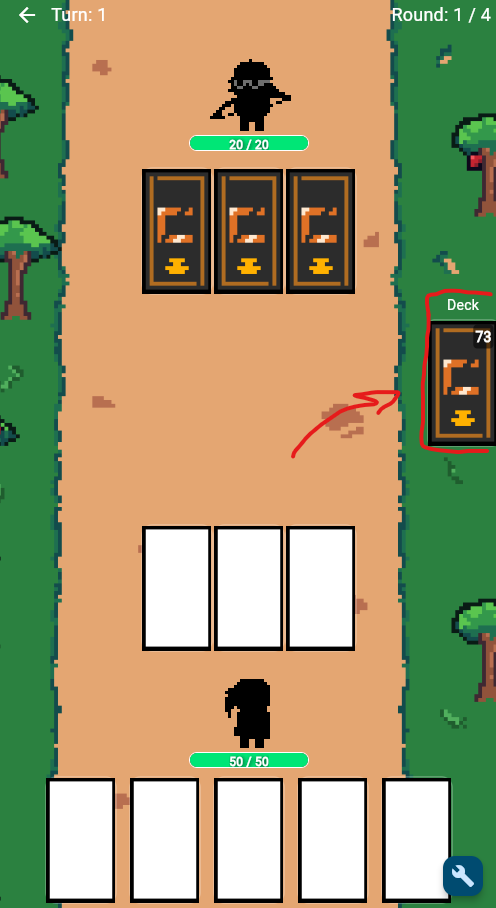

# CAMT Terminator – Challenge Answer: Draw Card Sound

This answer adds a short **sound effect** when the player draws new cards, using the same `just_audio` pattern explained in the tutorial.

---

## 1. Add the Draw Sound Asset

Place a new sound file in your project folder:

```
assets/sound/draw_card.mp3
```

Then register it in your `pubspec.yaml`:

```yaml
flutter:
  assets:
    - assets/sound/draw_card.mp3
```

This makes the file accessible for the `AudioPlayer` to load.

---

## 2. Update `playerDrawCards()` in `lib/cubit/card_cubit.dart`

Add the sound effect logic directly inside the draw function.

```dart
/// Draw cards until hand has 5
/// Optional exclusion of certain cards
Future<void> playerDrawCards({List<Card> exclude = const []}) async {
  const maxHandSize = 5;
  final toDraw = maxHandSize - handNotifier.value.length;
  if (toDraw <= 0) return;

  var drawn = deck
      .draw(toDraw, includeConsumables: true)
      .where((c) => !exclude.contains(c))
      .toList();

  // If deck is empty but discard has cards, recycle
  if (drawn.isEmpty && deck.discardPile.isNotEmpty) {
    deck.resetDeck();
    drawn = deck
        .draw(toDraw, includeConsumables: true)
        .where((c) => !exclude.contains(c))
        .toList();
  }

  if (drawn.isEmpty) return;

  // --- Play draw sound effect ---
  final drawSoundPlayer = AudioPlayer();
  try {
    await drawSoundPlayer.setAsset('assets/sound/draw_card.mp3'); // load sound
    await drawSoundPlayer.setVolume(0.8); // volume 80%
    await drawSoundPlayer.play(); // play once
  } catch (e) {
    print('Error playing draw sound: $e');
  } finally {
    drawSoundPlayer.dispose(); // release memory
  }
  // --- End of sound effect ---

  // Update hand
  final updatedHand = [...handNotifier.value, ...drawn];
  handNotifier.value = updatedHand;
  selectedCardsNotifier.value = [];

  // Reassign new Deck for UI update
  deckNotifier.value = Deck(cards: [...deck.cards])
    ..discardPile.addAll(deck.discardPile);
}
```

---

## 3. Result

Now, each time the player draws cards:

  

* The sound `draw_card.mp3` plays once
* It doesn’t interrupt or delay gameplay
* It gives immediate audio feedback when drawing cards

---

This completes the challenge — you’ve added a **responsive sound effect** for the draw action using the `just_audio` package.