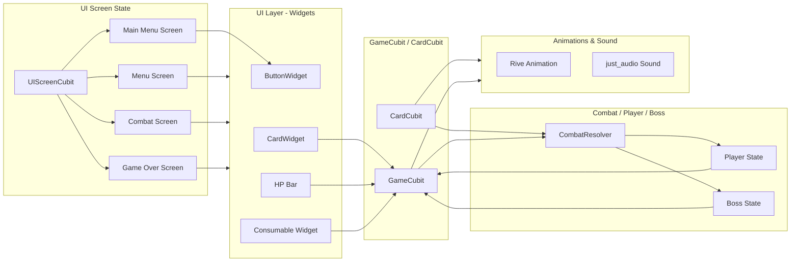

# CAMT Terminator - System Architecture Diagram

**Description:**

> This diagram illustrates how **UI screen navigation (UIScreenCubit)**, **UI widgets**, **gameplay state management (GameCubit / CardCubit)**, **combat logic (CombatResolver)**, **player and boss states**, and **visual/audio effects (Rive animations & just_audio sounds)** interact in CAMT Terminator.

It emphasizes the role of each layer, separates screen navigation from gameplay logic, and reads more naturally.

